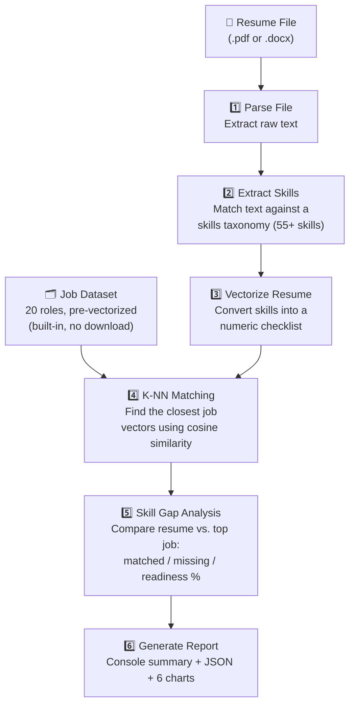
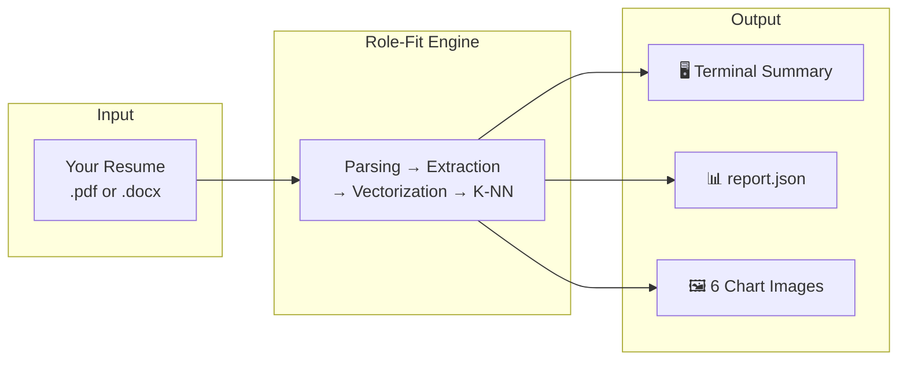

<div align="center">

# 🎯 Role-Fit

### Resume-to-Job Matching & Skill Gap Analysis

Upload your resume → get matched to the jobs you're most competitive for → see exactly which skills are holding you back.

<br/>


</div>

---

## 🧠 What is Role-Fit?

**Role-Fit** is a backend machine learning project that reads a resume (`.pdf` or `.docx`) and answers two questions for the candidate:

1. **"Which job roles am I most competitive for?"** — ranked using a **K-Nearest Neighbors (K-NN)** algorithm.
2. **"What exact skills are missing for my best-fit role?"** — a precise skill gap + readiness score.

No frontend, no external dataset download, no database setup. Run one command, get a full report plus six charts.

---

## ⚙️ How It Works — Step by Step

Think of it like a career counselor, but powered by math instead of intuition. Here's the journey your resume takes through the system:



### Stage-by-stage, in plain language

| Stage | What happens | Why it matters |
|---|---|---|
| **1. Parse File** | The `.pdf` or `.docx` is opened and its raw text is pulled out. | Computers can't read formatted documents directly — this turns it into plain text first. |
| **2. Extract Skills** | The text is scanned against a curated list of ~55 tech & soft skills (with synonyms, e.g. "JS" = "JavaScript"). | Produces a clean list of exactly which skills the resume actually contains. |
| **3. Vectorize** | Skills are converted into a "checklist" of 1s and 0s — one column per possible skill. | Machine learning models work with numbers, not words, so everything needs a numeric form. |
| **4. K-NN Matching** | The resume's checklist is compared to 20 job roles' checklists using **cosine similarity** — basically, "whose skill pattern looks most like mine?" | This is the actual ML algorithm — it finds the closest-matching jobs mathematically, not by guesswork. |
| **5. Skill Gap Analysis** | For the top matched job, the system subtracts: *skills the job needs* − *skills you have* = **gap**. | Tells you precisely what to learn next, ranked by importance. |
| **6. Report Generation** | Everything is printed to the terminal, saved as a JSON file, and turned into 6 charts. | Gives you both a machine-readable report and a human-readable visual summary. |

---

## 📥 What You Provide → 📤 What You Get



**Input:** just a file path to your resume — nothing else to configure.

**Output**, all saved to an `output/` folder:
- A readable summary printed straight to your terminal
- `report.json` — the same data in structured form
- 6 PNG charts (explained below)

---

## 🖼️ The 6 Visualizations You Get

| # | Chart | What it shows |
|---|---|---|
| 1 | **Top Job Matches** (bar chart) | Your top-K matched roles, ranked by similarity % |
| 2 | **Skill Match vs. Gap** (bar chart) | Which required skills you have (green) vs. are missing (red) for your best-fit role |
| 3 | **Readiness Donut** | A single glance at your "% ready" score for the top role |
| 4 | **Skill Coverage Radar** | Your skills vs. the job's requirements, overlaid on one spider chart |
| 5 | **Highest-Impact Missing Skills** | Which missing skills appear across *multiple* matched jobs — i.e. the best ROI to learn next |
| 6 | **2D Job-Space Map (PCA)** | A visual map of all 20 job roles, showing exactly where your resume "lands" among them |

---

## 🚀 Getting Started

### 1. Clone & install

```bash
git clone <your-repo-url>
cd role-fit
python -m venv venv
source venv/bin/activate        # Windows: venv\Scripts\activate
pip install -r requirements.txt
```

**Requirements:** Python 3.9+

### 2. Run it

```bash
python main.py
```

You'll be prompted:

```
Provide the path of your Resume File : 
```

Just type or paste the path to your resume and hit Enter. If it can't find the file, or the file isn't a `.pdf`/`.docx`, it'll politely ask again.

**Prefer scripting instead of the prompt?** Pass the path directly and it skips the question:

```bash
python main.py path/to/resume.pdf --k 7 --out my_results
```

| Argument | Description | Default |
|---|---|---|
| `resume_path` | Path to a `.pdf` or `.docx` resume. If omitted, you'll be prompted for it. | *(prompted)* |
| `--k` | Number of top job matches to return | `5` |
| `--out` | Output folder for charts + JSON report | `output` |

### 3. Try it instantly with the bundled sample

```bash
python main.py sample_resume.docx
```

---

## 📂 Project Structure

```
role-fit/
├── main.py              # Entry point — run this
├── matcher_core.py       # Parsing, skill extraction, K-NN model, gap analysis
├── job_data.py            # Skills taxonomy + built-in job dataset (the "database")
├── visualize.py           # Generates all 6 charts as PNGs
├── requirements.txt
├── sample_resume.docx     # Example resume for testing
├── sample_resume.pdf      # Same resume, PDF format
└── output/                # Auto-created — charts + report.json land here
```

---

## 🧩 The "Database" — No Download Needed

Instead of relying on an external dataset, `job_data.py` **is** the dataset: 20 common job roles (Data Scientist, Backend Developer, DevOps Engineer, etc.), each with a required-skills list and importance weights, generated directly in code. This means:

- Nothing to download, no broken links, no missing files
- Fully reproducible — anyone who clones the repo gets identical results
- Easy to extend — swap in a real job-postings CSV later without touching the rest of the pipeline (see below)

---

## 🔬 The ML Approach, In Detail

**Skill extraction** — resume text is matched against `SKILL_SYNONYMS` in `job_data.py`, which maps ~55 canonical skills to their common synonyms (e.g. `"js"`, `"javascript"`, `"es6"` → `JavaScript`). Matching is case-insensitive and word-boundary aware, so `"java"` won't wrongly match inside `"javascript"`.

**Vectorization** — both resumes and jobs become vectors in the same 55-dimensional skill space:
- Resume vector: binary (1 = has the skill, 0 = doesn't)
- Job vectors: weighted (1 = nice-to-have, 2 = important, 3 = must-have)

**K-NN matching** — `sklearn.neighbors.NearestNeighbors` finds the closest job vectors to the resume vector using **cosine distance**, which is well-suited to high-dimensional, sparse skill data because it compares the *pattern* of skills rather than raw counts.

**Skill gap analysis** — for the top matched job:
```
matched_skills   = required_skills ∩ resume_skills
missing_skills   = required_skills − resume_skills
readiness_score  = (Σ weights of matched skills) / (Σ weights of all required skills) × 100
```
Missing skills are ranked by importance weight, so you know what to prioritize first.

---

## 🛠️ Extending Role-Fit

- **Real job data**: replace `get_job_dataset()` in `job_data.py` with a loader for a real dataset (e.g. a Kaggle "LinkedIn Job Postings" CSV) — keep the same `{title, required_skills}` structure and the rest of the pipeline needs no changes.
- **Smarter extraction**: swap the keyword/synonym matcher for a spaCy `PhraseMatcher` or a fine-tuned NER model to handle messier, less-structured resumes.
- **Richer vectorization**: try TF-IDF or sentence-transformer embeddings instead of multi-hot encoding, to capture semantic similarity (e.g. "ML" ≈ "Machine Learning") without needing an explicit synonym entry.
- **Evaluation**: label a small validation set of (resume → correct job category) pairs and measure top-K accuracy; experiment with different K values and distance metrics (cosine vs. Euclidean vs. Jaccard).

---

## ⚠️ Known Limitations

- Scanned/image-only PDFs without a text layer can't be parsed (would need OCR, not included).
- Skill extraction only recognizes skills listed in `SKILL_SYNONYMS` — extend that dictionary in `job_data.py` to cover more skills or domains.
- The job dataset is illustrative (20 common tech/business roles), not scraped from live postings — see "Extending Role-Fit" above.

---

## 📄 License

MIT — free to use, modify, and build on for your own portfolio or coursework.

<div align="center">
<br/>
Made with 🐍 Python, scikit-learn, and a genuine curiosity about where your skills fit.
</div>
